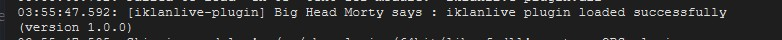
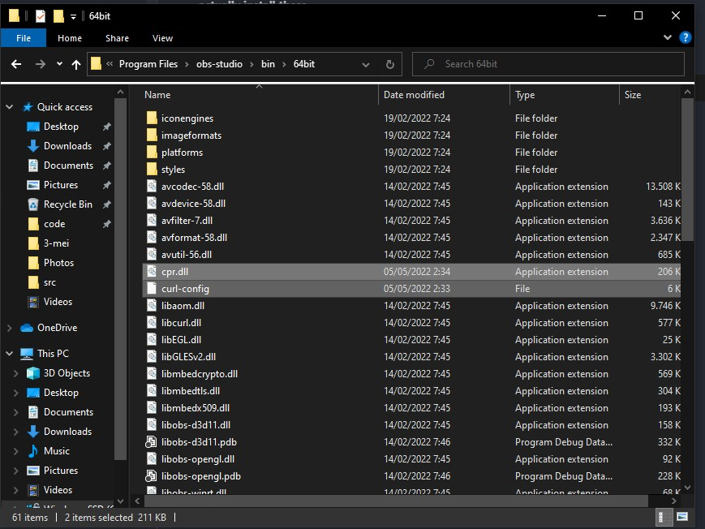

So i was able to get data and parse it

dependencies :

- cpr (for handling requests and responses)
- nlohmann json (for handling json parsing)

<b>note that dependencies are added to CMakeLists.txt with the FetchContent feature so no need to actually install these</b>

see src/plugin-main.cpp file to see how its done

Obs logs :

 </img>

note that you need to add dll files from the `release/bin` folder to obs-studio

 </img>

in my case, there are 2 files generated in the `release/bin`:

- cpr.dll
- curl-config
